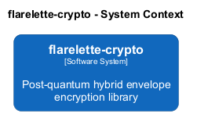
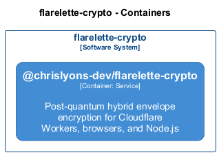

#  flarelette-crypto

**Architecture Documentation**
Generated 2026-03-02 20:15:34

## Overview

Post-quantum hybrid envelope encryption library

---

## System Context

The system context diagram shows how flarelette-crypto fits into its environment, including external systems and users.

---

## Containers

The container diagram shows the high-level technology choices and how containers communicate.

| Container                             | Type      | Description                                                                           | Details                                       |
| ------------------------------------- | --------- | ------------------------------------------------------------------------------------- | --------------------------------------------- |
| **@chrislyons-dev/flarelette-crypto** | `Service` | Post-quantum hybrid envelope encryption for Cloudflare Workers, browsers, and Node.js | [View](./chrislyons_dev_flarelette_crypto.md) |

---

Generated with <a href="https://github.com/chrislyons-dev/archlette">Archlette</a> Architecture-as-Code toolkit

