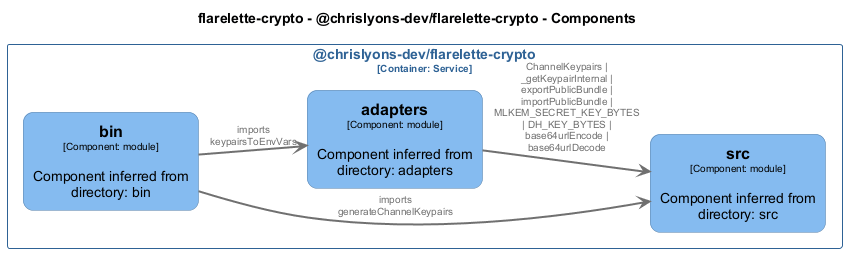

# @chrislyons-dev/flarelette-crypto

[← Back to System Overview](./README.md)

---

## Container Context

---

## Container Information

| Field           | Value                                                                                 |
| --------------- | ------------------------------------------------------------------------------------- | --- | -------- | ---------------- |
| **Name**        | @chrislyons-dev/flarelette-crypto                                                     |
| **Type**        | `Service`                                                                             |
| **Description** | Post-quantum hybrid envelope encryption for Cloudflare Workers, browsers, and Node.js |     | **Tags** | `Auto-generated` |

---

## Components

### Component View

### Component Details

| Component    | Type     | Description                                 | Code                                                    |
| ------------ | -------- | ------------------------------------------- | ------------------------------------------------------- |
| **src**      | `module` | Component inferred from directory: src      | [View](./chrislyons_dev_flarelette_crypto__src.md)      |
| **adapters** | `module` | Component inferred from directory: adapters | [View](./chrislyons_dev_flarelette_crypto__adapters.md) |
| **bin**      | `module` | Component inferred from directory: bin      | [View](./chrislyons_dev_flarelette_crypto__bin.md)      |

---

<a href="./README.md">← Back to System Overview</a> | Generated with <a href="https://github.com/chrislyons-dev/archlette">Archlette</a>

