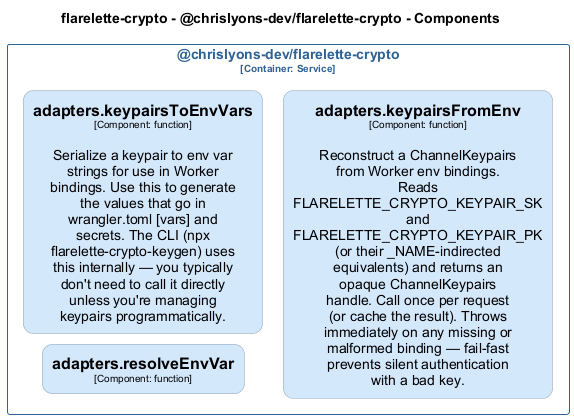

# adapters — Code View

[← Back to Container](./chrislyons_dev_flarelette_crypto.md) | [← Back to System](./README.md)

---

## Component Information

| Field           | Value                                       |
| --------------- | ------------------------------------------- |
| **Component**   | adapters                                    |
| **Container**   | @chrislyons-dev/flarelette-crypto           |
| **Type**        | `module`                                    |
| **Description** | Component inferred from directory: adapters |

---

## Code Structure

### Class Diagram

### Code Elements

<strong>3 code element(s)</strong>

#### Functions

##### `resolveEnvVar()`

| Field          | Value      |
| -------------- | ---------- | --- | ------------ | ----------------------------------------------------------------------------------------------- |
| **Type**       | `function` |
| **Visibility** | `private`  |
| **Returns**    | `string`   |     | **Location** | `C:/Users/chris/git/flarelette-crypto/packages/flarelette-crypto-ts/src/adapters/workers.ts:39` |

**Parameters:**

- `env`: <code>Record<string, string></code>- `varName`: <code>string</code>

---

##### `keypairsToEnvVars()`

Serialize a keypair to env var strings for use in Worker bindings.

Use this to generate the values that go in wrangler.toml [vars] and secrets.
The CLI (npx flarelette-crypto-keygen) uses this internally — you typically
don't need to call it directly unless you're managing keypairs programmatically.

| Field          | Value                                                                             |
| -------------- | --------------------------------------------------------------------------------- | --- | ------------ | ----------------------------------------------------------------------------------------------- |
| **Type**       | `function`                                                                        |
| **Visibility** | `public`                                                                          |
| **Returns**    | `{ FLARELETTE_CRYPTO_KEYPAIR_SK: string; FLARELETTE_CRYPTO_KEYPAIR_PK: string; }` |     | **Location** | `C:/Users/chris/git/flarelette-crypto/packages/flarelette-crypto-ts/src/adapters/workers.ts:55` |

**Parameters:**

- `keypairs`: <code>import("C:/Users/chris/git/flarelette-crypto/packages/flarelette-crypto-ts/src/types").ChannelKeypairs</code>

---

##### `keypairsFromEnv()`

Reconstruct a ChannelKeypairs from Worker env bindings.

Reads FLARELETTE_CRYPTO_KEYPAIR_SK and FLARELETTE_CRYPTO_KEYPAIR_PK (or their
\_NAME-indirected equivalents) and returns an opaque ChannelKeypairs handle.

Call once per request (or cache the result). Throws immediately on any missing
or malformed binding — fail-fast prevents silent authentication with a bad key.

| Field          | Value                                                                                                    |
| -------------- | -------------------------------------------------------------------------------------------------------- | --- | ------------ | ----------------------------------------------------------------------------------------------- |
| **Type**       | `function`                                                                                               |
| **Visibility** | `public`                                                                                                 |
| **Returns**    | `import("C:/Users/chris/git/flarelette-crypto/packages/flarelette-crypto-ts/src/types").ChannelKeypairs` |     | **Location** | `C:/Users/chris/git/flarelette-crypto/packages/flarelette-crypto-ts/src/adapters/workers.ts:82` |

**Parameters:**

- `env`: <code>Record<string, string></code> — The Worker env object, or any Record<string, string> for testing.

---

---

<a href="./chrislyons_dev_flarelette_crypto.md">← Back to Container</a> | <a href="./README.md">← Back to System</a> | Generated with <a href="https://github.com/chrislyons-dev/archlette">Archlette</a>

