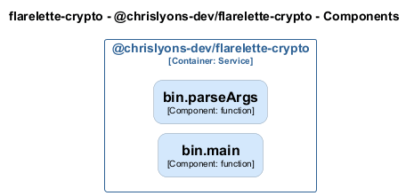

# bin — Code View

[← Back to Container](./chrislyons_dev_flarelette_crypto.md) | [← Back to System](./README.md)

---

## Component Information

| Field           | Value                                  |
| --------------- | -------------------------------------- |
| **Component**   | bin                                    |
| **Container**   | @chrislyons-dev/flarelette-crypto      |
| **Type**        | `module`                               |
| **Description** | Component inferred from directory: bin |

---

## Code Structure

### Class Diagram

### Code Elements

<strong>2 code element(s)</strong>

#### Functions

##### `parseArgs()`

| Field          | Value                               |
| -------------- | ----------------------------------- | --- | ------------ | ----------------------------------------------------------------------------------------- |
| **Type**       | `function`                          |
| **Visibility** | `private`                           |
| **Returns**    | `{ alg: string; dotenv: boolean; }` |     | **Location** | `C:/Users/chris/git/flarelette-crypto/packages/flarelette-crypto-ts/src/bin/keygen.ts:35` |

**Parameters:**

- `argv`: <code>string[]</code>

---

##### `main()`

| Field          | Value      |
| -------------- | ---------- | --- | ------------ | ----------------------------------------------------------------------------------------- |
| **Type**       | `function` |
| **Visibility** | `private`  |
| **Returns**    | `void`     |     | **Location** | `C:/Users/chris/git/flarelette-crypto/packages/flarelette-crypto-ts/src/bin/keygen.ts:41` |

---

---

<a href="./chrislyons_dev_flarelette_crypto.md">← Back to Container</a> | <a href="./README.md">← Back to System</a> | Generated with <a href="https://github.com/chrislyons-dev/archlette">Archlette</a>

