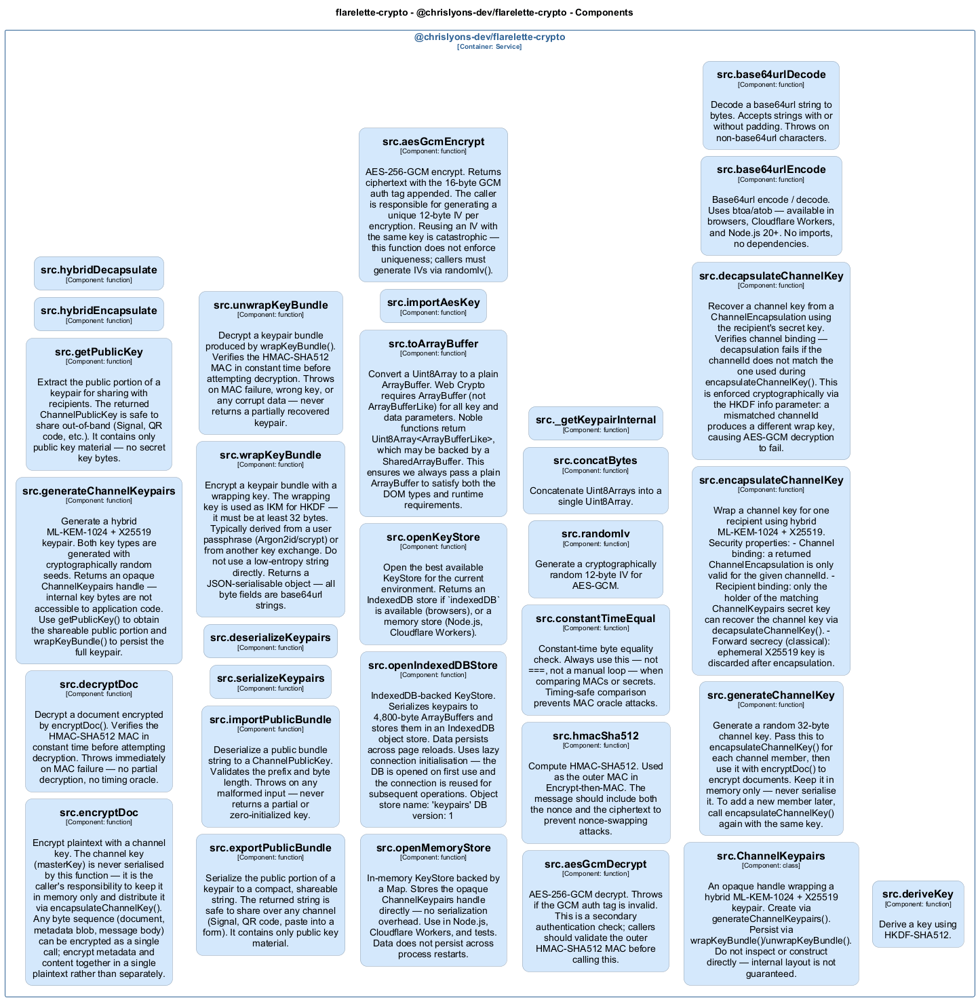

# src — Code View

[← Back to Container](./chrislyons_dev_flarelette_crypto.md) | [← Back to System](./README.md)

---

## Component Information

| Field           | Value                                  |
| --------------- | -------------------------------------- |
| **Component**   | src                                    |
| **Container**   | @chrislyons-dev/flarelette-crypto      |
| **Type**        | `module`                               |
| **Description** | Component inferred from directory: src |

---

## Code Structure

### Class Diagram

### Code Elements

<strong>31 code element(s)</strong>

#### Classes

##### `ChannelKeypairs`

An opaque handle wrapping a hybrid ML-KEM-1024 + X25519 keypair.

Create via generateChannelKeypairs(). Persist via wrapKeyBundle()/unwrapKeyBundle().
Do not inspect or construct directly — internal layout is not guaranteed.

| Field          | Value                                                                                |
| -------------- | ------------------------------------------------------------------------------------ |
| **Type**       | `class`                                                                              |
| **Visibility** | `public`                                                                             |
| **Location**   | `C:/Users/chris/git/flarelette-crypto/packages/flarelette-crypto-ts/src/types.ts:32` |

---

#### Functions

##### `generateChannelKey()`

Generate a random 32-byte channel key.

Pass this to encapsulateChannelKey() for each channel member, then use it with
encryptDoc() to encrypt documents. Keep it in memory only — never serialise it.
To add a new member later, call encapsulateChannelKey() again with the same key.

| Field          | Value                         |
| -------------- | ----------------------------- | --- | ------------ | -------------------------------------------------------------------------------------- |
| **Type**       | `function`                    |
| **Visibility** | `public`                      |
| **Returns**    | `Uint8Array<ArrayBufferLike>` |     | **Location** | `C:/Users/chris/git/flarelette-crypto/packages/flarelette-crypto-ts/src/channel.ts:29` |

---

##### `encapsulateChannelKey()`

Wrap a channel key for one recipient using hybrid ML-KEM-1024 + X25519.

Security properties:

- Channel binding: a returned ChannelEncapsulation is only valid for the given channelId.
- Recipient binding: only the holder of the matching ChannelKeypairs secret key can
  recover the channel key via decapsulateChannelKey().
- Forward secrecy (classical): ephemeral X25519 key is discarded after encapsulation.

| Field          | Value      |
| -------------- | ---------- | --- | ----------- | ---------------------------------------------------------------------------------------------------------------------- | --- | ------------ | -------------------------------------------------------------------------------------- |
| **Type**       | `function` |
| **Visibility** | `public`   |
| **Async**      | Yes        |     | **Returns** | `Promise<import("C:/Users/chris/git/flarelette-crypto/packages/flarelette-crypto-ts/src/types").ChannelEncapsulation>` |     | **Location** | `C:/Users/chris/git/flarelette-crypto/packages/flarelette-crypto-ts/src/channel.ts:55` |

**Parameters:**

- `channelKey`: <code>Uint8Array<ArrayBufferLike></code> — 32-byte random key shared among channel members. Generate with
  generateChannelKey(). This value is never serialised by this library.- `recipient`: <code>import("C:/Users/chris/git/flarelette-crypto/packages/flarelette-crypto-ts/src/types").ChannelPublicKey</code> — The recipient's public key, obtained from getPublicKey() or
  importPublicBundle() (Phase 2).- `channelId`: <code>string</code> — Stable identifier for the channel (e.g. UUID or database row ID).
  Must match exactly when calling decapsulateChannelKey().

---

##### `decapsulateChannelKey()`

Recover a channel key from a ChannelEncapsulation using the recipient's secret key.

Verifies channel binding — decapsulation fails if the channelId does not match
the one used during encapsulateChannelKey(). This is enforced cryptographically
via the HKDF info parameter: a mismatched channelId produces a different wrap key,
causing AES-GCM decryption to fail.

| Field          | Value      |
| -------------- | ---------- | --- | ----------- | ----------------------------------------------------------------- | --- | ------------ | -------------------------------------------------------------------------------------- |
| **Type**       | `function` |
| **Visibility** | `public`   |
| **Async**      | Yes        |     | **Returns** | `Promise<Uint8Array<ArrayBufferLike>>` - The 32-byte channel key. |     | **Location** | `C:/Users/chris/git/flarelette-crypto/packages/flarelette-crypto-ts/src/channel.ts:98` |

**Parameters:**

- `encapsulation`: <code>import("C:/Users/chris/git/flarelette-crypto/packages/flarelette-crypto-ts/src/types").ChannelEncapsulation</code> — Produced by encapsulateChannelKey() for this recipient.- `keypairs`: <code>import("C:/Users/chris/git/flarelette-crypto/packages/flarelette-crypto-ts/src/types").ChannelKeypairs</code> — The recipient's full keypair (must include the secret key).- `channelId`: <code>string</code> — Must match the channelId used during encapsulation.

---

##### `base64urlEncode()`

Base64url encode / decode.

Uses btoa/atob — available in browsers, Cloudflare Workers, and Node.js 20+.
No imports, no dependencies.

| Field          | Value      |
| -------------- | ---------- | --- | ------------ | ------------------------------------------------------------------------------------ |
| **Type**       | `function` |
| **Visibility** | `public`   |
| **Returns**    | `string`   |     | **Location** | `C:/Users/chris/git/flarelette-crypto/packages/flarelette-crypto-ts/src/codec.ts:11` |

**Parameters:**

- `bytes`: <code>Uint8Array<ArrayBufferLike></code>

---

##### `base64urlDecode()`

Decode a base64url string to bytes.

Accepts strings with or without padding. Throws on non-base64url characters.

| Field          | Value                         |
| -------------- | ----------------------------- | --- | ------------ | ------------------------------------------------------------------------------------ |
| **Type**       | `function`                    |
| **Visibility** | `public`                      |
| **Returns**    | `Uint8Array<ArrayBufferLike>` |     | **Location** | `C:/Users/chris/git/flarelette-crypto/packages/flarelette-crypto-ts/src/codec.ts:24` |

**Parameters:**

- `s`: <code>string</code>

---

##### `deriveKey()`

Derive a key using HKDF-SHA512.

| Field          | Value                         |
| -------------- | ----------------------------- | --- | ------------ | ------------------------------------------------------------------------------------- |
| **Type**       | `function`                    |
| **Visibility** | `public`                      |
| **Returns**    | `Uint8Array<ArrayBufferLike>` |     | **Location** | `C:/Users/chris/git/flarelette-crypto/packages/flarelette-crypto-ts/src/derive.ts:20` |

**Parameters:**

- `ikm`: <code>Uint8Array<ArrayBufferLike></code> — Input key material (e.g. concatenated KEM shared secrets)- `info`: <code>string</code> — Context string — must be unique per key purpose and derivation site- `length`: <code>number</code> — Output length in bytes (default: 32)

---

##### `encryptDoc()`

Encrypt plaintext with a channel key.

The channel key (masterKey) is never serialised by this function — it is the
caller's responsibility to keep it in memory only and distribute it via
encapsulateChannelKey(). Any byte sequence (document, metadata blob, message body)
can be encrypted as a single call; encrypt metadata and content together in a
single plaintext rather than separately.

| Field          | Value      |
| -------------- | ---------- | --- | ----------- | -------------------------------------------------------------------------------------------------------------- | --- | ------------ | ---------------------------------------------------------------------------------- |
| **Type**       | `function` |
| **Visibility** | `public`   |
| **Async**      | Yes        |     | **Returns** | `Promise<import("C:/Users/chris/git/flarelette-crypto/packages/flarelette-crypto-ts/src/types").EncryptedDoc>` |     | **Location** | `C:/Users/chris/git/flarelette-crypto/packages/flarelette-crypto-ts/src/doc.ts:43` |

**Parameters:**

- `plaintext`: <code>Uint8Array<ArrayBufferLike></code> — Arbitrary bytes to encrypt.- `masterKey`: <code>Uint8Array<ArrayBufferLike></code> — 32-byte channel key from decapsulateChannelKey().

---

##### `decryptDoc()`

Decrypt a document encrypted by encryptDoc().

Verifies the HMAC-SHA512 MAC in constant time before attempting decryption.
Throws immediately on MAC failure — no partial decryption, no timing oracle.

| Field          | Value      |
| -------------- | ---------- | --- | ----------- | -------------------------------------- | --- | ------------ | ---------------------------------------------------------------------------------- |
| **Type**       | `function` |
| **Visibility** | `public`   |
| **Async**      | Yes        |     | **Returns** | `Promise<Uint8Array<ArrayBufferLike>>` |     | **Location** | `C:/Users/chris/git/flarelette-crypto/packages/flarelette-crypto-ts/src/doc.ts:73` |

**Parameters:**

- `doc`: <code>import("C:/Users/chris/git/flarelette-crypto/packages/flarelette-crypto-ts/src/types").EncryptedDoc</code> — Produced by encryptDoc().- `masterKey`: <code>Uint8Array<ArrayBufferLike></code> — The same 32-byte channel key used for encryption.

---

##### `generateChannelKeypairs()`

Generate a hybrid ML-KEM-1024 + X25519 keypair.

Both key types are generated with cryptographically random seeds.
Returns an opaque ChannelKeypairs handle — internal key bytes are not
accessible to application code. Use getPublicKey() to obtain the shareable
public portion and wrapKeyBundle() to persist the full keypair.

| Field          | Value                                                                                                    |
| -------------- | -------------------------------------------------------------------------------------------------------- | --- | ------------ | ---------------------------------------------------------------------------------- |
| **Type**       | `function`                                                                                               |
| **Visibility** | `public`                                                                                                 |
| **Returns**    | `import("C:/Users/chris/git/flarelette-crypto/packages/flarelette-crypto-ts/src/types").ChannelKeypairs` |     | **Location** | `C:/Users/chris/git/flarelette-crypto/packages/flarelette-crypto-ts/src/kem.ts:40` |

---

##### `getPublicKey()`

Extract the public portion of a keypair for sharing with recipients.

The returned ChannelPublicKey is safe to share out-of-band (Signal, QR code, etc.).
It contains only public key material — no secret key bytes.

| Field          | Value                                                                                                     |
| -------------- | --------------------------------------------------------------------------------------------------------- | --- | ------------ | ---------------------------------------------------------------------------------- |
| **Type**       | `function`                                                                                                |
| **Visibility** | `public`                                                                                                  |
| **Returns**    | `import("C:/Users/chris/git/flarelette-crypto/packages/flarelette-crypto-ts/src/types").ChannelPublicKey` |     | **Location** | `C:/Users/chris/git/flarelette-crypto/packages/flarelette-crypto-ts/src/kem.ts:58` |

**Parameters:**

- `keypairs`: <code>import("C:/Users/chris/git/flarelette-crypto/packages/flarelette-crypto-ts/src/types").ChannelKeypairs</code>

---

##### `hybridEncapsulate()`

| Field          | Value                                                                                                                                                        |
| -------------- | ------------------------------------------------------------------------------------------------------------------------------------------------------------ | --- | ------------ | ---------------------------------------------------------------------------------- |
| **Type**       | `function`                                                                                                                                                   |
| **Visibility** | `public`                                                                                                                                                     |
| **Returns**    | `{ kemCt: Uint8Array<ArrayBufferLike>; dhEphemeral: Uint8Array<ArrayBufferLike>; mlkemSs: Uint8Array<ArrayBufferLike>; dhSs: Uint8Array<ArrayBufferLike>; }` |     | **Location** | `C:/Users/chris/git/flarelette-crypto/packages/flarelette-crypto-ts/src/kem.ts:78` |

**Parameters:**

- `recipient`: <code>import("C:/Users/chris/git/flarelette-crypto/packages/flarelette-crypto-ts/src/types").ChannelPublicKey</code>

---

##### `hybridDecapsulate()`

| Field          | Value                                                                          |
| -------------- | ------------------------------------------------------------------------------ | --- | ------------ | ----------------------------------------------------------------------------------- |
| **Type**       | `function`                                                                     |
| **Visibility** | `public`                                                                       |
| **Returns**    | `{ mlkemSs: Uint8Array<ArrayBufferLike>; dhSs: Uint8Array<ArrayBufferLike>; }` |     | **Location** | `C:/Users/chris/git/flarelette-crypto/packages/flarelette-crypto-ts/src/kem.ts:105` |

**Parameters:**

- `kemCt`: <code>Uint8Array<ArrayBufferLike></code>- `dhEphemeral`: <code>Uint8Array<ArrayBufferLike></code>- `keypairs`: <code>import("C:/Users/chris/git/flarelette-crypto/packages/flarelette-crypto-ts/src/types").ChannelKeypairs</code>

---

##### `exportPublicBundle()`

Serialize the public portion of a keypair to a compact, shareable string.

The returned string is safe to share over any channel (Signal, QR code,
paste into a form). It contains only public key material.

| Field          | Value      |
| -------------- | ---------- | --- | ------------ | ---------------------------------------------------------------------------------------- |
| **Type**       | `function` |
| **Visibility** | `public`   |
| **Returns**    | `string`   |     | **Location** | `C:/Users/chris/git/flarelette-crypto/packages/flarelette-crypto-ts/src/serialize.ts:35` |

**Parameters:**

- `keypairs`: <code>import("C:/Users/chris/git/flarelette-crypto/packages/flarelette-crypto-ts/src/types").ChannelKeypairs</code>

---

##### `importPublicBundle()`

Deserialize a public bundle string to a ChannelPublicKey.

Validates the prefix and byte length. Throws on any malformed input —
never returns a partial or zero-initialized key.

| Field          | Value                                                                                                     |
| -------------- | --------------------------------------------------------------------------------------------------------- | --- | ------------ | ---------------------------------------------------------------------------------------- |
| **Type**       | `function`                                                                                                |
| **Visibility** | `public`                                                                                                  |
| **Returns**    | `import("C:/Users/chris/git/flarelette-crypto/packages/flarelette-crypto-ts/src/types").ChannelPublicKey` |     | **Location** | `C:/Users/chris/git/flarelette-crypto/packages/flarelette-crypto-ts/src/serialize.ts:49` |

**Parameters:**

- `encoded`: <code>string</code>

---

##### `serializeKeypairs()`

| Field          | Value                         |
| -------------- | ----------------------------- | --- | ------------ | ------------------------------------------------------------------------------------ |
| **Type**       | `function`                    |
| **Visibility** | `private`                     |
| **Returns**    | `Uint8Array<ArrayBufferLike>` |     | **Location** | `C:/Users/chris/git/flarelette-crypto/packages/flarelette-crypto-ts/src/store.ts:58` |

**Parameters:**

- `kp`: <code>import("C:/Users/chris/git/flarelette-crypto/packages/flarelette-crypto-ts/src/types").ChannelKeypairs</code>

---

##### `deserializeKeypairs()`

| Field          | Value                                                                                                    |
| -------------- | -------------------------------------------------------------------------------------------------------- | --- | ------------ | ------------------------------------------------------------------------------------ |
| **Type**       | `function`                                                                                               |
| **Visibility** | `private`                                                                                                |
| **Returns**    | `import("C:/Users/chris/git/flarelette-crypto/packages/flarelette-crypto-ts/src/types").ChannelKeypairs` |     | **Location** | `C:/Users/chris/git/flarelette-crypto/packages/flarelette-crypto-ts/src/store.ts:72` |

**Parameters:**

- `bytes`: <code>Uint8Array<ArrayBufferLike></code>

---

##### `wrapKeyBundle()`

Encrypt a keypair bundle with a wrapping key.

The wrapping key is used as IKM for HKDF — it must be at least 32 bytes.
Typically derived from a user passphrase (Argon2id/scrypt) or from another
key exchange. Do not use a low-entropy string directly.

Returns a JSON-serialisable object — all byte fields are base64url strings.

| Field          | Value      |
| -------------- | ---------- | --- | ----------- | --------------------------------------------------------------------------------------------------------------- | --- | ------------ | ------------------------------------------------------------------------------------- |
| **Type**       | `function` |
| **Visibility** | `public`   |
| **Async**      | Yes        |     | **Returns** | `Promise<import("C:/Users/chris/git/flarelette-crypto/packages/flarelette-crypto-ts/src/types").WrappedBundle>` |     | **Location** | `C:/Users/chris/git/flarelette-crypto/packages/flarelette-crypto-ts/src/store.ts:104` |

**Parameters:**

- `keypairs`: <code>import("C:/Users/chris/git/flarelette-crypto/packages/flarelette-crypto-ts/src/types").ChannelKeypairs</code>- `wrappingKey`: <code>Uint8Array<ArrayBufferLike></code>

---

##### `unwrapKeyBundle()`

Decrypt a keypair bundle produced by wrapKeyBundle().

Verifies the HMAC-SHA512 MAC in constant time before attempting decryption.
Throws on MAC failure, wrong key, or any corrupt data — never returns a
partially recovered keypair.

| Field          | Value      |
| -------------- | ---------- | --- | ----------- | ----------------------------------------------------------------------------------------------------------------- | --- | ------------ | ------------------------------------------------------------------------------------- |
| **Type**       | `function` |
| **Visibility** | `public`   |
| **Async**      | Yes        |     | **Returns** | `Promise<import("C:/Users/chris/git/flarelette-crypto/packages/flarelette-crypto-ts/src/types").ChannelKeypairs>` |     | **Location** | `C:/Users/chris/git/flarelette-crypto/packages/flarelette-crypto-ts/src/store.ts:134` |

**Parameters:**

- `wrapped`: <code>import("C:/Users/chris/git/flarelette-crypto/packages/flarelette-crypto-ts/src/types").WrappedBundle</code>- `wrappingKey`: <code>Uint8Array<ArrayBufferLike></code>

---

##### `openMemoryStore()`

In-memory KeyStore backed by a Map.

Stores the opaque ChannelKeypairs handle directly — no serialization overhead.
Use in Node.js, Cloudflare Workers, and tests.
Data does not persist across process restarts.

| Field          | Value                                                                                             |
| -------------- | ------------------------------------------------------------------------------------------------- | --- | ------------ | ------------------------------------------------------------------------------------- |
| **Type**       | `function`                                                                                        |
| **Visibility** | `public`                                                                                          |
| **Returns**    | `import("C:/Users/chris/git/flarelette-crypto/packages/flarelette-crypto-ts/src/store").KeyStore` |     | **Location** | `C:/Users/chris/git/flarelette-crypto/packages/flarelette-crypto-ts/src/store.ts:192` |

---

##### `openIndexedDBStore()`

IndexedDB-backed KeyStore.

Serializes keypairs to 4,800-byte ArrayBuffers and stores them in an
IndexedDB object store. Data persists across page reloads.

Uses lazy connection initialisation — the DB is opened on first use and
the connection is reused for subsequent operations.

Object store name: 'keypairs'
DB version: 1

| Field          | Value                                                                                             |
| -------------- | ------------------------------------------------------------------------------------------------- | --- | ------------ | ------------------------------------------------------------------------------------- |
| **Type**       | `function`                                                                                        |
| **Visibility** | `public`                                                                                          |
| **Returns**    | `import("C:/Users/chris/git/flarelette-crypto/packages/flarelette-crypto-ts/src/store").KeyStore` |     | **Location** | `C:/Users/chris/git/flarelette-crypto/packages/flarelette-crypto-ts/src/store.ts:227` |

**Parameters:**

- `dbName`: <code>string</code>

---

##### `openKeyStore()`

Open the best available KeyStore for the current environment.

Returns an IndexedDB store if `indexedDB` is available (browsers), or
a memory store (Node.js, Cloudflare Workers).

| Field          | Value                                                                                             |
| -------------- | ------------------------------------------------------------------------------------------------- | --- | ------------ | ------------------------------------------------------------------------------------- |
| **Type**       | `function`                                                                                        |
| **Visibility** | `public`                                                                                          |
| **Returns**    | `import("C:/Users/chris/git/flarelette-crypto/packages/flarelette-crypto-ts/src/store").KeyStore` |     | **Location** | `C:/Users/chris/git/flarelette-crypto/packages/flarelette-crypto-ts/src/store.ts:317` |

**Parameters:**

- `options`: <code>{ dbName?: string; }</code>

---

##### `toArrayBuffer()`

Convert a Uint8Array to a plain ArrayBuffer.

Web Crypto requires ArrayBuffer (not ArrayBufferLike) for all key and data
parameters. Noble functions return Uint8Array<ArrayBufferLike>, which may
be backed by a SharedArrayBuffer. This ensures we always pass a plain
ArrayBuffer to satisfy both the DOM types and runtime requirements.

| Field          | Value         |
| -------------- | ------------- | --- | ------------ | ---------------------------------------------------------------------------------------- |
| **Type**       | `function`    |
| **Visibility** | `private`     |
| **Returns**    | `ArrayBuffer` |     | **Location** | `C:/Users/chris/git/flarelette-crypto/packages/flarelette-crypto-ts/src/symmetric.ts:28` |

**Parameters:**

- `bytes`: <code>Uint8Array<ArrayBufferLike></code>

---

##### `importAesKey()`

| Field          | Value      |
| -------------- | ---------- | --- | ----------- | -------------------- | --- | ------------ | ---------------------------------------------------------------------------------------- |
| **Type**       | `function` |
| **Visibility** | `private`  |
| **Async**      | Yes        |     | **Returns** | `Promise<CryptoKey>` |     | **Location** | `C:/Users/chris/git/flarelette-crypto/packages/flarelette-crypto-ts/src/symmetric.ts:37` |

**Parameters:**

- `key`: <code>Uint8Array<ArrayBufferLike></code>- `usage`: <code>"encrypt" | "decrypt"</code>

---

##### `aesGcmEncrypt()`

AES-256-GCM encrypt.

Returns ciphertext with the 16-byte GCM auth tag appended.
The caller is responsible for generating a unique 12-byte IV per encryption.
Reusing an IV with the same key is catastrophic — this function does not enforce
uniqueness; callers must generate IVs via randomIv().

| Field          | Value      |
| -------------- | ---------- | --- | ----------- | -------------------------------------- | --- | ------------ | ---------------------------------------------------------------------------------------- |
| **Type**       | `function` |
| **Visibility** | `public`   |
| **Async**      | Yes        |     | **Returns** | `Promise<Uint8Array<ArrayBufferLike>>` |     | **Location** | `C:/Users/chris/git/flarelette-crypto/packages/flarelette-crypto-ts/src/symmetric.ts:56` |

**Parameters:**

- `key`: <code>Uint8Array<ArrayBufferLike></code>- `iv`: <code>Uint8Array<ArrayBufferLike></code>- `plaintext`: <code>Uint8Array<ArrayBufferLike></code>

---

##### `aesGcmDecrypt()`

AES-256-GCM decrypt.

Throws if the GCM auth tag is invalid. This is a secondary authentication check;
callers should validate the outer HMAC-SHA512 MAC before calling this.

| Field          | Value      |
| -------------- | ---------- | --- | ----------- | -------------------------------------- | --- | ------------ | ---------------------------------------------------------------------------------------- |
| **Type**       | `function` |
| **Visibility** | `public`   |
| **Async**      | Yes        |     | **Returns** | `Promise<Uint8Array<ArrayBufferLike>>` |     | **Location** | `C:/Users/chris/git/flarelette-crypto/packages/flarelette-crypto-ts/src/symmetric.ts:76` |

**Parameters:**

- `key`: <code>Uint8Array<ArrayBufferLike></code>- `iv`: <code>Uint8Array<ArrayBufferLike></code>- `ciphertext`: <code>Uint8Array<ArrayBufferLike></code>

---

##### `hmacSha512()`

Compute HMAC-SHA512.

Used as the outer MAC in Encrypt-then-MAC. The message should include both
the nonce and the ciphertext to prevent nonce-swapping attacks.

| Field          | Value                         |
| -------------- | ----------------------------- | --- | ------------ | ----------------------------------------------------------------------------------------- |
| **Type**       | `function`                    |
| **Visibility** | `public`                      |
| **Returns**    | `Uint8Array<ArrayBufferLike>` |     | **Location** | `C:/Users/chris/git/flarelette-crypto/packages/flarelette-crypto-ts/src/symmetric.ts:100` |

**Parameters:**

- `key`: <code>Uint8Array<ArrayBufferLike></code>- `message`: <code>Uint8Array<ArrayBufferLike></code>

---

##### `constantTimeEqual()`

Constant-time byte equality check.

Always use this — not ===, not a manual loop — when comparing MACs or secrets.
Timing-safe comparison prevents MAC oracle attacks.

| Field          | Value      |
| -------------- | ---------- | --- | ------------ | ----------------------------------------------------------------------------------------- |
| **Type**       | `function` |
| **Visibility** | `public`   |
| **Returns**    | `boolean`  |     | **Location** | `C:/Users/chris/git/flarelette-crypto/packages/flarelette-crypto-ts/src/symmetric.ts:110` |

**Parameters:**

- `a`: <code>Uint8Array<ArrayBufferLike></code>- `b`: <code>Uint8Array<ArrayBufferLike></code>

---

##### `randomIv()`

Generate a cryptographically random 12-byte IV for AES-GCM.

| Field          | Value                         |
| -------------- | ----------------------------- | --- | ------------ | ----------------------------------------------------------------------------------------- |
| **Type**       | `function`                    |
| **Visibility** | `public`                      |
| **Returns**    | `Uint8Array<ArrayBufferLike>` |     | **Location** | `C:/Users/chris/git/flarelette-crypto/packages/flarelette-crypto-ts/src/symmetric.ts:119` |

---

##### `concatBytes()`

Concatenate Uint8Arrays into a single Uint8Array.

| Field          | Value                         |
| -------------- | ----------------------------- | --- | ------------ | ----------------------------------------------------------------------------------------- |
| **Type**       | `function`                    |
| **Visibility** | `public`                      |
| **Returns**    | `Uint8Array<ArrayBufferLike>` |     | **Location** | `C:/Users/chris/git/flarelette-crypto/packages/flarelette-crypto-ts/src/symmetric.ts:124` |

**Parameters:**

- `arrays`: <code>Uint8Array<ArrayBufferLike>[]</code>

---

##### `_getKeypairInternal()`

| Field          | Value                                                                                                    |
| -------------- | -------------------------------------------------------------------------------------------------------- | --- | ------------ | ------------------------------------------------------------------------------------ |
| **Type**       | `function`                                                                                               |
| **Visibility** | `public`                                                                                                 |
| **Returns**    | `import("C:/Users/chris/git/flarelette-crypto/packages/flarelette-crypto-ts/src/types").KeypairInternal` |     | **Location** | `C:/Users/chris/git/flarelette-crypto/packages/flarelette-crypto-ts/src/types.ts:40` |

**Parameters:**

- `kp`: <code>import("C:/Users/chris/git/flarelette-crypto/packages/flarelette-crypto-ts/src/types").ChannelKeypairs</code>

---

---

<a href="./chrislyons_dev_flarelette_crypto.md">← Back to Container</a> | <a href="./README.md">← Back to System</a> | Generated with <a href="https://github.com/chrislyons-dev/archlette">Archlette</a>

